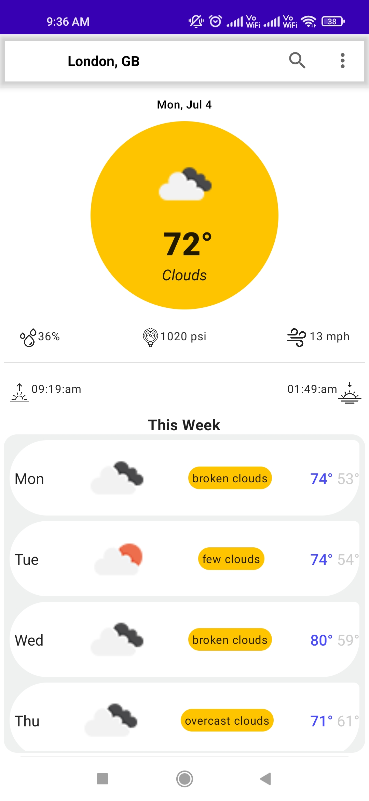
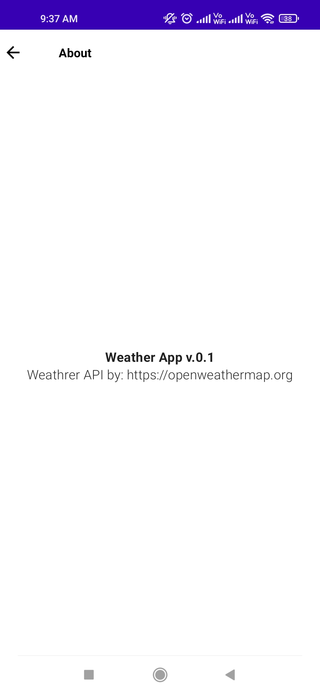
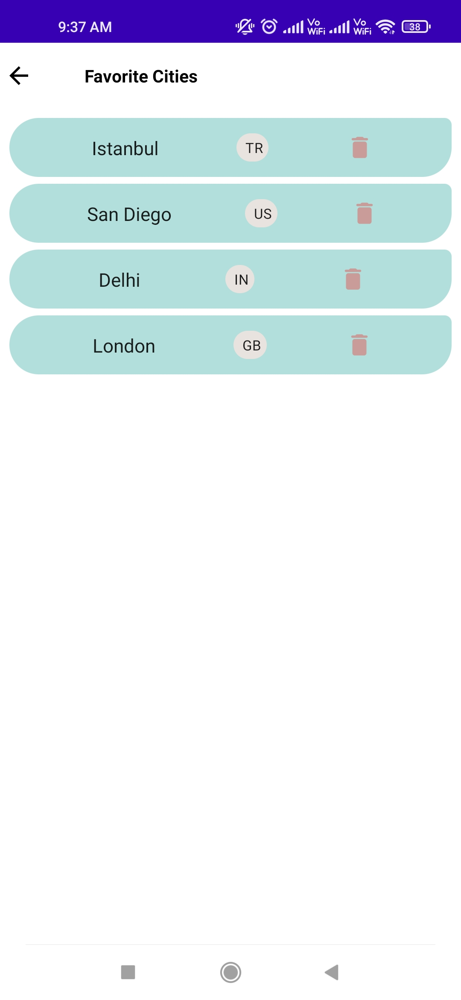
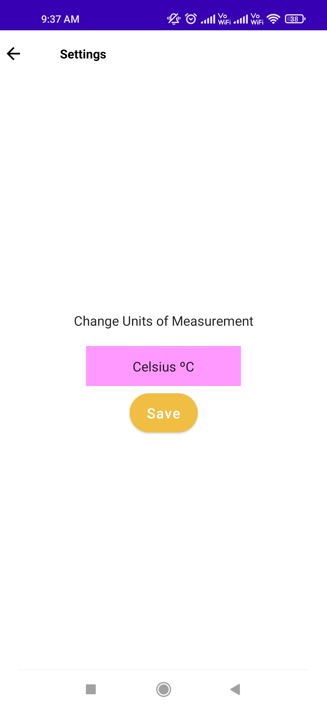
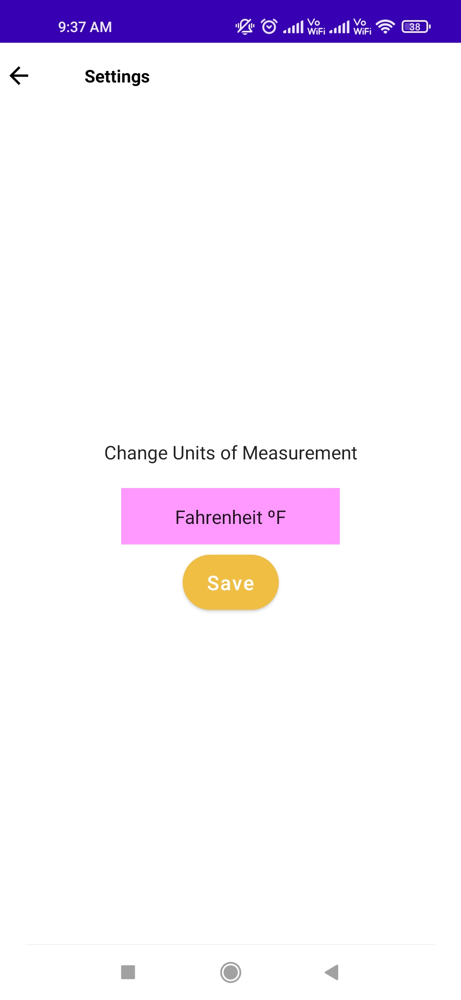
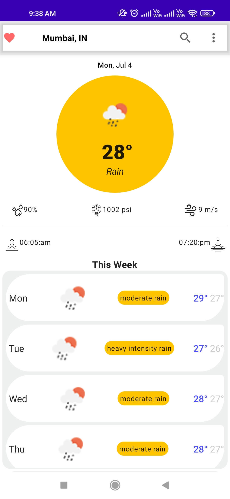
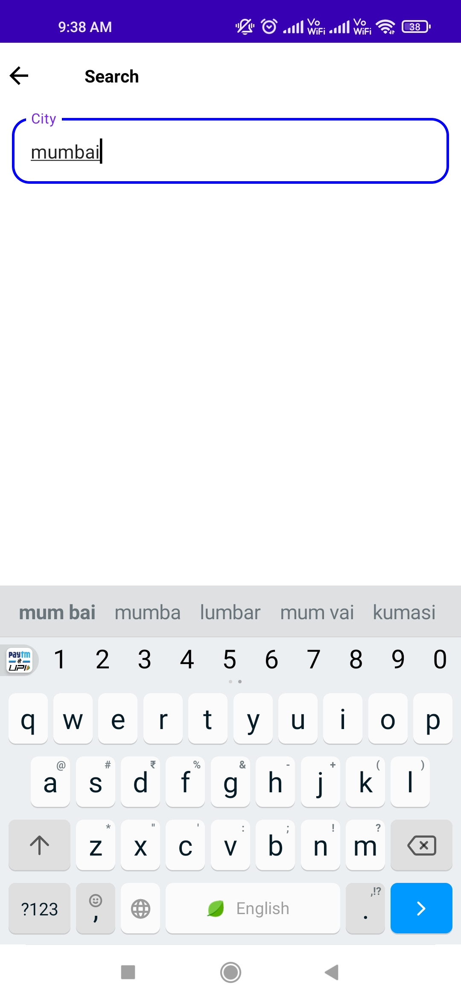

# WeatherForecast-App
**Weather-Forecast** Application is a weather application made by using **JetPack Compose**. The user can search for various cities on the globe and get the weather forecast for the entire week so they can plan ahead. 
User can also save their favorite cities so they dont have to search for them everytime. The favorite cities are stored using **Room database**. 
There is also an option for setting in the top bar where the user can change the units from **Metric-units(celsius)** to **Imperial-units(fahrenheit)** or vice-versa depending on their preferences.
The application also display information about the level of humidity, pressure or wind speed. All the information displayed in the application is received from **openweathermap.org** using **Retrofit**. 
This application also uses **Hilt & Dagger**, **ViewModel**, **Navigation** and **MVVM Clean architecture**.

                                                   

    

                               

                              

